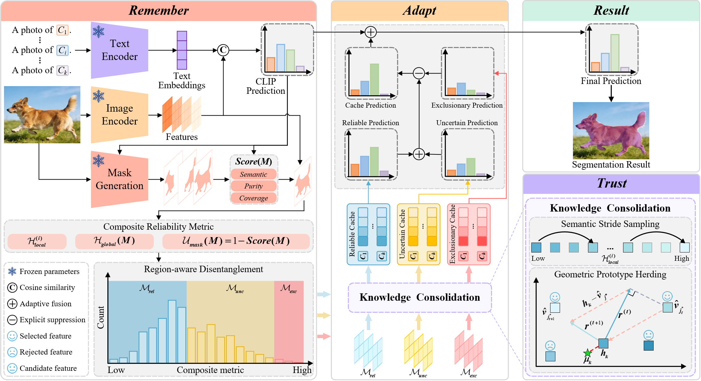

# Remember, Trust, and Adapt: Robust Test-Time Knowledge Transfer for Open-Vocabulary Semantic Segmentation

The official implementation of our paper **“Remember, Trust, and Adapt: Robust Test-Time Knowledge Transfer for Open-Vocabulary Semantic Segmentation.”**

## Method

<p align="justify">
<b>Abstract:</b> Open-vocabulary semantic segmentation (OVSS) aims to assign pixel-level semantic labels from an open vocabulary, yet its performance often degrades severely under test-time domain shift. Existing methods typically adapt each test sample independently or directly accumulate pseudo-labeled predictions, making them vulnerable to boundary ambiguity, noisy region predictions, and error accumulation during online adaptation. We propose a Robust Test-time knowledge trAnsfer framework (RTA) for OVSS under domain shift. Instead of treating historical predictions as flat pseudo-labels, RTA transforms them into robust transferable knowledge that can be reused to improve subsequent predictions. The Remember module constructs region-level knowledge by integrating coarse CLIP semantics with SAM-generated masks, and separates the resulting knowledge into reliable, uncertain, and exclusionary memories using a composite reliability metric. The Trust module consolidates this knowledge into compact and representative feature-label pairs. Finally, the Adapt module exploits the dynamically updated memory through uncertainty-aware fusion with the original CLIP predictions. Extensive experiments on standard OVSS benchmarks demonstrate that RTA improves robustness under domain shift and outperforms strong baselines.
</p>

<p align="center">
    
</p>

<div style="margin-bottom: 15px;"></div>

* **Remember:** We construct region-level knowledge from coarse NACLIP predictions and SAM masks, then divide it into reliable, uncertain, and exclusionary memories.

* **Trust:** We consolidate region-associated features with stride sampling and herding to retain compact, representative evidence for each category.

* **Adapt:** We compute class-wise maximum cache affinity and use entropy-aware fusion to combine cache evidence with the original CLIP logits.

The clean release follows the main paper configuration only. Severity sweeps, SAM generalization, and baseline compatibility are kept outside this implementation as ablation/evaluation records.

## Requirements

- [Python 3.10.13](https://www.python.org/)
- [CUDA 11.8](https://developer.nvidia.com/cuda-zone)
- [PyTorch 2.1.2](https://pytorch.org/)
- [MMSegmentation 1.2.2](https://github.com/open-mmlab/mmsegmentation)
- SAM ViT-H checkpoint

## Getting Started

### Step 1: Requirements

Create the environment and install the dependencies:

```bash
conda create -n rta python==3.10.13
conda activate rta
pip install torch==2.1.2 torchvision==0.16.2 torchaudio==2.1.2 --index-url https://download.pytorch.org/whl/cu118
pip install -r requirements.txt
```

Download the SAM ViT-H checkpoint and place it at:

```text
./weights/sam_vit_h_4b8939.pth
```

The NACLIP implementation uses the `ViT-L/14` CLIP checkpoint through the bundled CLIP loader. The first run may download it to the local CLIP cache.

---

### Step 2: Prepare Datasets

The implementation supports the following open-vocabulary segmentation benchmarks:

- [PASCAL VOC 20/21](https://paperswithcode.com/dataset/pascal-voc) – 20 foreground categories, with the optional 21-class extension.
- [PASCAL Context 59/60](https://paperswithcode.com/paper/the-role-of-context-for-object-detection-and) – 59 foreground categories, with the optional 60-class extension.
- [Cityscapes](https://www.cityscapes-dataset.com/) – 19 urban-scene categories.
- [COCO-Object](https://arxiv.org/abs/1405.0312) – 80 object categories.
- [COCO-Stuff 164k](https://arxiv.org/abs/1612.03716) – 164 thing-and-stuff categories.

Please follow the [MMSegmentation dataset preparation guide](https://github.com/open-mmlab/mmsegmentation/blob/main/docs/en/user_guides/2_dataset_prepare.md) to download and preprocess the datasets. The public RTA entry point evaluates the original validation split; datasets and checkpoints are not included in this repository.

Set the dataset path when launching:

```bash
DATA_DIR=/path/to/dataset
```

---

### Step 3: Perform Adaptation

There is a bash file in `./bash/v20` prepared to reproduce the clean PASCAL VOC 20 (v20) setting of the paper. The public implementation exposes RTA only; corruption sweeps, SAM generalization, and baseline compatibility experiments are not included here.

To reproduce our results on PASCAL VOC 20 (v20)—the clean split—simply run `./bash/v20/rta.sh`:

```bash
# GPU Configuration
GPU_ID=0

# Dataset Configuration
DATASET=PascalVOC20Dataset
DATA_DIR=".data/VOC2012/"
INIT_RESIZE="224 224"
WORKERS=4

# Method and OVSS Model Configuration
METHOD="rta"
OUT_VISION="-1 -2 -3 -4 -5 -6 -7 -8 -9 -10 -11 -12 -13 -14 -15 -16 -17 -18"
PROMPT_DIR="prompts.yaml"
ALPHA_CLS=1.0
OVSS_TYPE="naclip"
OVSS_BACKBONE="ViT-L/14"

# SAM Configuration
SAM_CHECKPOINT="./weights/sam_vit_h_4b8939.pth"
SAM_MODEL_TYPE="vit_h"

# RTA Hyperparameters
BATCH_SIZE=1
LR=0.001
STEPS=10
TRIALS=3
P_REL=40
P_UNC=85
LOCAL_CACHE_CAPACITY=10
LOCAL_CACHE_SAMPLE_STRIDE=3
SAMPLES_PER_MASK=3
LOCAL_CACHE_BETA=5.0

# Output
SAVE_DIR=".save/${DATASET}/${METHOD}/"

# Run
CUDA_VISIBLE_DEVICES=$GPU_ID bash ./bash/v20/rta.sh
```

## Results

Comparison with state-of-the-art TTA methods for open-vocabulary semantic segmentation. The following table is reproduced from **Table I of our paper**. For a more detailed analysis and the complete experimental protocol, please refer to the paper.

*The table follows the layout of Table I; bold values in the Ours column include the improvement over TDA+SAM.*

<div align="center">
<table style="border-collapse:collapse; width:100%; font-size:0.85em; text-align:center; white-space:nowrap;">
<thead>
<tr style="border-top:2px solid #222; border-bottom:1px solid #999;">
<th colspan="2">Methods</th>
<th>NoAdapt</th>
<th>TENT</th>
<th>TPT</th>
<th>WATT</th>
<th>CLIPArTT</th>
<th>MLMP</th>
<th>Point-Cache</th>
<th>MLMP+SAM</th>
<th>TDA+SAM</th>
<th><strong>Ours</strong></th>
</tr>
</thead>
<tbody>
<tr><td colspan="2">V20 (Original)</td><td>75.91</td><td>77.00</td><td>75.93</td><td>57.73</td><td>72.77</td><td>83.76</td><td>84.68</td><td>86.10</td><td>86.47</td><td><strong>88.24↑1.77</strong></td></tr>
<tr><td rowspan="15"><strong>V20-C</strong></td><td>Gaussian noise</td><td>62.89</td><td>63.02</td><td>62.98</td><td>36.44</td><td>53.36</td><td>71.13</td><td>71.79</td><td>71.46</td><td>71.91</td><td><strong>73.72↑1.81</strong></td></tr>
<tr><td>Shot noise</td><td>66.26</td><td>65.88</td><td>66.33</td><td>40.95</td><td>58.15</td><td>75.02</td><td>75.96</td><td>75.42</td><td>75.89</td><td><strong>77.90↑2.01</strong></td></tr>
<tr><td>Impulse noise</td><td>63.16</td><td>64.17</td><td>63.12</td><td>34.90</td><td>54.83</td><td>71.34</td><td>71.61</td><td>72.69</td><td>73.81</td><td><strong>74.99↑1.18</strong></td></tr>
<tr><td>Defocus blur</td><td>72.59</td><td>72.06</td><td>72.55</td><td>52.43</td><td>65.39</td><td>80.36</td><td>80.24</td><td>80.08</td><td>80.71</td><td><strong>82.14↑1.43</strong></td></tr>
<tr><td>Glass blur</td><td>71.44</td><td>70.74</td><td>71.40</td><td>49.96</td><td>64.62</td><td>78.84</td><td>78.93</td><td>78.46</td><td>79.41</td><td><strong>80.05↑0.64</strong></td></tr>
<tr><td>Motion blur</td><td>73.10</td><td>73.50</td><td>73.16</td><td>53.35</td><td>67.48</td><td>81.41</td><td>82.14</td><td>80.25</td><td>80.59</td><td><strong>82.26↑1.67</strong></td></tr>
<tr><td>Zoom blur</td><td>59.03</td><td>61.36</td><td>59.00</td><td>41.39</td><td>52.37</td><td>69.41</td><td>69.32</td><td>69.49</td><td>69.47</td><td><strong>71.37↑1.90</strong></td></tr>
<tr><td>Snow</td><td>71.49</td><td>71.04</td><td>71.44</td><td>51.18</td><td>66.97</td><td>79.53</td><td>79.91</td><td>81.05</td><td>80.56</td><td><strong>83.50↑2.94</strong></td></tr>
<tr><td>Frost</td><td>65.38</td><td>67.01</td><td>65.46</td><td>45.75</td><td>60.48</td><td>73.20</td><td>73.33</td><td>76.78</td><td>76.56</td><td><strong>78.49↑1.93</strong></td></tr>
<tr><td>Fog</td><td>70.69</td><td>70.54</td><td>70.70</td><td>52.96</td><td>67.85</td><td>79.81</td><td>79.89</td><td>82.80</td><td>83.15</td><td><strong>85.05↑1.90</strong></td></tr>
<tr><td>Brightness</td><td>74.95</td><td>75.61</td><td>74.95</td><td>55.82</td><td>71.52</td><td>83.51</td><td>83.77</td><td>86.06</td><td>85.37</td><td><strong>87.99↑2.62</strong></td></tr>
<tr><td>Contrast</td><td>71.51</td><td>70.51</td><td>71.49</td><td>50.74</td><td>66.01</td><td>79.06</td><td>79.30</td><td>79.99</td><td>79.87</td><td><strong>82.72↑2.85</strong></td></tr>
<tr><td>Elastic transform</td><td>62.86</td><td>65.78</td><td>62.95</td><td>45.45</td><td>60.41</td><td>74.03</td><td>74.29</td><td>77.05</td><td>77.95</td><td><strong>79.12↑1.17</strong></td></tr>
<tr><td>Pixelate</td><td>77.28</td><td>76.95</td><td>77.31</td><td>59.76</td><td>73.14</td><td>84.97</td><td>84.61</td><td>83.73</td><td>83.92</td><td><strong>84.99↑1.07</strong></td></tr>
<tr><td>JPEG compression</td><td>72.59</td><td>71.84</td><td>72.56</td><td>53.44</td><td>68.21</td><td>82.06</td><td>82.37</td><td>81.54</td><td>81.86</td><td><strong>82.79↑0.93</strong></td></tr>
<tr style="border-top:1px solid #999; border-bottom:1px solid #999;"><td></td><td><strong>Mean</strong></td><td>69.01</td><td>69.33</td><td>69.03</td><td>48.30</td><td>63.39</td><td>77.58</td><td>77.83</td><td>78.46</td><td>78.74</td><td><strong>80.47↑1.73</strong></td></tr>
<tr><td colspan="2">V21 (Original)</td><td>45.12</td><td>45.65</td><td>45.17</td><td>28.58</td><td>39.50</td><td>50.78</td><td>51.12</td><td>53.44</td><td>53.78</td><td><strong>60.07↑6.29</strong></td></tr>
<tr><td colspan="2">V21-C</td><td>40.75</td><td>40.95</td><td>40.77</td><td>24.12</td><td>34.16</td><td>46.25</td><td>46.56</td><td>47.34</td><td>47.71</td><td><strong>53.04↑5.33</strong></td></tr>
<tr style="border-top:1px solid #999;"><td colspan="2">P59 (Original)</td><td>28.23</td><td>28.73</td><td>28.26</td><td>16.55</td><td>24.60</td><td>31.95</td><td>32.35</td><td>33.54</td><td>33.89</td><td><strong>38.22↑4.33</strong></td></tr>
<tr><td colspan="2">P59-C</td><td>23.88</td><td>23.88</td><td>23.88</td><td>13.37</td><td>19.72</td><td>27.03</td><td>27.31</td><td>28.33</td><td>28.56</td><td><strong>31.46↑2.90</strong></td></tr>
<tr style="border-top:1px solid #999;"><td colspan="2">P60 (Original)</td><td>24.95</td><td>25.29</td><td>24.98</td><td>14.77</td><td>21.88</td><td>27.99</td><td>28.25</td><td>29.75</td><td>30.28</td><td><strong>33.26↑2.98</strong></td></tr>
<tr><td colspan="2">P60-C</td><td>21.39</td><td>21.25</td><td>21.49</td><td>12.08</td><td>17.79</td><td>24.07</td><td>24.30</td><td>24.89</td><td>25.39</td><td><strong>27.92↑2.53</strong></td></tr>
<tr style="border-top:1px solid #999;"><td colspan="2">Cityscapes (Original)</td><td>29.49</td><td>30.54</td><td>29.57</td><td>20.77</td><td>–</td><td>33.35</td><td>33.64</td><td>34.61</td><td>35.02</td><td><strong>41.77↑6.75</strong></td></tr>
<tr><td colspan="2">Cityscapes-C</td><td>21.63</td><td>21.64</td><td>21.60</td><td>13.45</td><td>–</td><td>23.02</td><td>23.31</td><td>24.37</td><td>24.87</td><td><strong>28.69↑3.82</strong></td></tr>
<tr style="border-top:1px solid #999;"><td colspan="2">COCO-Object (Original)</td><td>23.80</td><td>24.88</td><td>23.84</td><td>14.14</td><td>21.34</td><td>28.84</td><td>28.99</td><td>29.26</td><td>29.67</td><td><strong>33.02↑3.35</strong></td></tr>
<tr><td colspan="2">COCO-Stuff (Original)</td><td>18.34</td><td>18.76</td><td>18.35</td><td>9.49</td><td>15.48</td><td>21.25</td><td>21.34</td><td>22.49</td><td>22.74</td><td><strong>25.23↑2.49</strong></td></tr>
</tbody>
</table>
</div>
